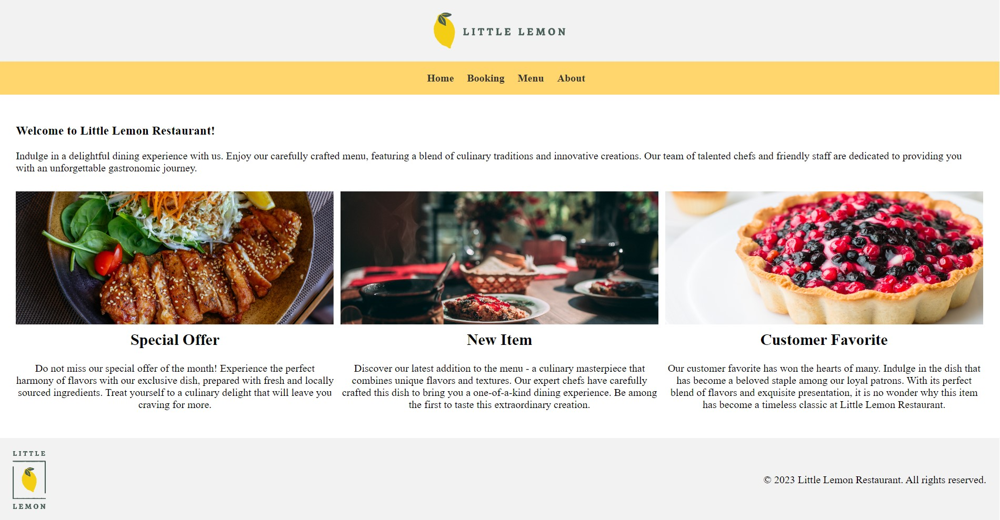

# Little Lemon Restaurant

Little Lemon Restaurant is a project is built in React as part of Coursera's Front-End Developer Capstone Certificate.

## Table of Contents

- [Introduction](#introduction)
- [Features](#features)
- [Technologies](#technologies)
- [Installation](#installation)

## Introduction

Little Lemon Restaurant is a fictional restaurant specializing in Italian cuisine. This website serves as an online presence for the restaurant, allowing customers to view the menu, make reservations, and learn more about the restaurant.



## Features

- Home page with promotional banners and featured menu items
- Menu page showcasing a variety of Italian dishes
- Booking page for making reservations
- About page providing information about the restaurant

## Technologies

- React.js
- React Router
- CSS
- HTML

## Installation

```bash
- git clone https://github.com/DonatellaC/little-lemon-coursera-capstone
- install all project dependencies with `npm install`
- start the development server with `npm start`
